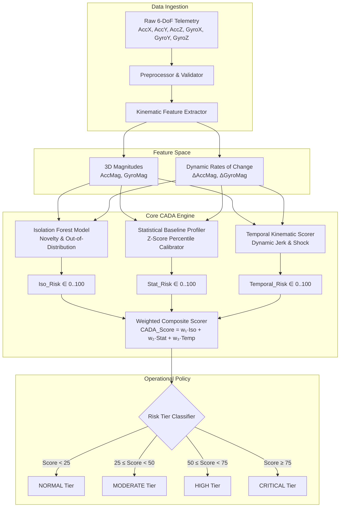

# CADA Technical Architecture & Mathematical Foundations

## 1. System Overview

**CADA (Continuous Anomaly Detection Architecture)** solves the fundamental limitations of discrete multi-class driving classifiers. Traditional classifiers output rigid category labels (e.g. `AGGRESSIVE`, `NORMAL`, `SLOW`), which fail to capture transitional risk dynamics, severity nuances, or unobserved anomaly types.

CADA provides:

1. **Continuous 0–100 Safety Risk Index**: Quantifies how dangerous or anomalous a driving maneuver is in real-time.
2. **Semi-Supervised Normal Baseline Calibration**: Learns the manifold of safe, normal driving without requiring exhaustive anomaly labels.
3. **Multi-Faceted Risk Attribution**: Separates geometric novelty ($Iso\_Risk$), statistical force deviation ($Stat\_Risk$), and dynamic jerk ($Temporal\_Risk$).
4. **Actionable 4-Tier Operational Policy**: Discretizes scores into `NORMAL`, `MODERATE`, `HIGH`, and `CRITICAL`.

---

## 2. Pipeline Architecture

---

## 3. Mathematical Formulations

### 3.1 Kinematic Feature Extraction

Given tri-axial acceleration $\mathbf{a} = [a_x, a_y, a_z]^T$ and angular velocity $\boldsymbol{\omega} = [\omega_x, \omega_y, \omega_z]^T$:

1. **Total Acceleration Magnitude**:
   $$\text{AccMag} = \|\mathbf{a}\|_2 = \sqrt{a_x^2 + a_y^2 + a_z^2}$$

2. **Total Gyroscopic Magnitude**:
   $$\text{GyroMag} = \|\boldsymbol{\omega}\|_2 = \sqrt{\omega_x^2 + \omega_y^2 + \omega_z^2}$$

3. **Instantaneous Jerk & Angular Acceleration**:
   $$\Delta \text{AccMag}_t = \text{AccMag}_t - \text{AccMag}_{t-1}$$
   $$\Delta \text{GyroMag}_t = \text{GyroMag}_t - \text{GyroMag}_{t-1}$$

---

### 3.2 Sub-Component Risk Models

#### Component 1: Isolation Forest Novelty Score ($Iso\_Risk$)

Trained strictly on normal baseline observations $\mathcal{D}_{\text{normal}}$. Given decision function $s(\mathbf{x}) \in [\min_s, \max_s]$:
$$\text{Iso\_Risk}(\mathbf{x}) = \left(1 - \frac{s(\mathbf{x}) - \min_s}{\max_s - \min_s + \epsilon}\right) \times 100$$
Higher values represent points isolated with fewer tree splits (severe geometric novelty).

#### Component 2: Statistical Baseline Deviation ($Stat\_Risk$)

Calibrated against baseline feature means $\boldsymbol{\mu}_{\text{normal}}$ and standard deviations $\boldsymbol{\sigma}_{\text{normal}}$ across $D$ features:
$$Z(\mathbf{x}) = \frac{1}{D} \sum_{j=1}^D \frac{|x_j - \mu_j|}{\sigma_j}$$
Let $L_{95}$ be the 95th percentile of $Z(\mathbf{x})$ over normal driving. The statistical risk score is:
$$\text{Stat\_Risk}(\mathbf{x}) = \min\left(100, \frac{Z(\mathbf{x})}{L_{95}} \times 50\right)$$

- $Z(\mathbf{x}) = 0 \implies \text{Stat\_Risk} = 0$
- $Z(\mathbf{x}) = L_{95} \implies \text{Stat\_Risk} = 50$ (Upper boundary of safe driving)
- $Z(\mathbf{x}) \ge 2 \cdot L_{95} \implies \text{Stat\_Risk} = 100$

#### Component 3: Temporal Jerk Risk ($Temporal\_Risk$)

Measures instantaneous shock and sharp rotation transitions:
$$\delta_{\text{temporal}}(\mathbf{x}) = |\Delta \text{AccMag}| + |\Delta \text{GyroMag}|$$
$$\text{Temporal\_Risk}(\mathbf{x}) = \min\left(100, \max\left(0, \frac{\delta_{\text{temporal}}(\mathbf{x}) - \min_\delta}{\max_\delta - \min_\delta + \epsilon} \times 100\right)\right)$$
Where $\max_\delta$ is calibrated to the 99th percentile of dynamic transitions.

---

### 3.3 Unified CADA Composite Score

$$\text{CADA\_Score}(\mathbf{x}) = \frac{w_{\text{iso}} \cdot \text{Iso\_Risk} + w_{\text{stat}} \cdot \text{Stat\_Risk} + w_{\text{temp}} \cdot \text{Temporal\_Risk}}{w_{\text{iso}} + w_{\text{stat}} + w_{\text{temp}}}$$
By default, balanced equal weights are used: $w_{\text{iso}} = w_{\text{stat}} = w_{\text{temp}} = \frac{1}{3}$.

---

## 4. Operational Risk Tiers

| Tier           |    Range    | Safety Definition                                               | Operational Action             |
| :------------- | :---------: | :-------------------------------------------------------------- | :----------------------------- |
| **`NORMAL`**   |  $[0, 25)$  | Baseline driving behavior within normal statistical boundaries. | Routine telemetry logging.     |
| **`MODERATE`** | $[25, 50)$  | Minor deviations (e.g. brisk acceleration, highway merging).    | Passive dashboard display.     |
| **`HIGH`**     | $[50, 75)$  | Pronounced sudden steering, hard braking, or erratic swerve.    | Audible driver advisory.       |
| **`CRITICAL`** | $[75, 100]$ | Extreme shock, emergency collision avoidance, or rollover risk. | Urgent alert & event dispatch. |
